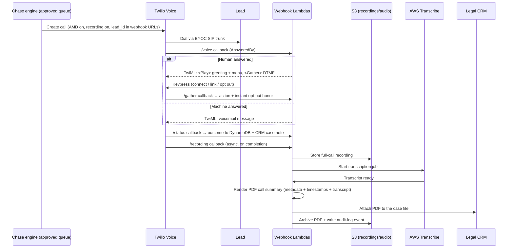

# TCPA-Compliant Outbound Voice Engine — Case Study

The voice channel of a production lead-chase system for a U.S. personal-injury law firm: automated outbound calls that re-engage leads the intake team couldn't reach — built to be **deterministic, consent-gated, and legally auditable** end to end.

> **About this repo.** Case study of a live client system; identifying details anonymized, code in [`excerpts/`](excerpts/) sanitized and representative. Production source is private.

---

## Why this is hard

Calling a lead on behalf of a law firm is the highest-stakes automation in the platform. Three constraint classes shaped the whole design:

1. **Regulatory (TCPA).** Only leads with recorded prior express consent may be called; opt-outs must be honored instantly and permanently; call-time and per-state rules apply.
2. **Evidentiary.** A law firm must be able to *prove* what happened on every call — who was called, what was played, what the person pressed, and what was said.
3. **Experience.** The firm's principal set a hard bar: no robotic TTS on real leads, no "I'm an AI" cold-open, and a wrong-word opt-out (someone politely saying "bye bye") must be impossible.

## The decision that shaped everything: LLM voice agent → deterministic IVR

The first build used a conversational voice-AI vendor. Testing surfaced a disqualifying platform behavior: **the agent starts speaking on SIP `200 OK`, not on true human pickup** — so it talked over ringback and voicemail greetings. Worse, an LLM interpreting open speech meant a polite "bye bye" could be *understood* as an opt-out, and a hallucinated response could misstate a legal matter.

The conclusion I reached (and documented for the client): a lead-chase call doesn't need conversation — it needs a **reliable, provable menu**. So the voice touch was rebuilt on raw Twilio Programmable Voice:

- **Answering-machine detection (AMD)** — `MachineDetection=Enable`; the webhook branches on `AnsweredBy`, so the menu plays only after a human answers, and voicemail gets a purpose-built message instead.
- **DTMF-only `<Gather>` IVR** — the system responds to keypad digits exclusively (connect me / send me the link / stop calling). Speech is never interpreted, so an opt-out is always an explicit, logged keypress. Deterministic by construction: no LLM in the call path at all.
- **Identity in the URL, not the model.** The lead ID rides in the webhook URL of each callback, so state transitions are keyed by construction — nothing an AI could fabricate.
- **BYOC SIP trunking** through the firm's regional carrier, so calls egress from the firm's own known numbers with CNAM and STIR/SHAKEN attestation intact — answered as the firm, not as spam-likely.
- **Human-quality audio.** Static prompts are pre-rendered with a premium ElevenLabs voice and served via `<Play>` from S3; the personalized greeting ("Hi \<first name\>...") is rendered on demand and **cached in S3 keyed by sanitized first name**, so the thousandth "Hi Maria" costs nothing. Synthetic TTS remains only as a pipeline-test fallback.

## The audit trail (recording → transcript → PDF → CRM)

Every call produces a self-contained evidentiary chain, fully automated:

The result: for any call, the firm can produce the recording, the verbatim transcript, a human-readable PDF summary time-stamped in the firm's timezone, the DTMF the lead pressed, and the consent record that authorized the call in the first place — without anyone lifting a finger.

## Safety and rollout engineering

- **Layered kill switches.** The dialer is gated by a `VOICE_ENABLED`-style flag (default **off**); daily schedules deploy in a disabled state; and a human preview/approval gate in the dashboard selects exactly which leads a run may call. Infrastructure ships to production dark, then each layer is enabled deliberately.
- **Consent is a hard gate, not a filter.** The TCPA-consent check sits in the call-trigger path itself; a lead without recorded consent cannot be dialed regardless of upstream decisions.
- **Volume discipline.** Per-number daily self-caps and carrier trunk-capacity limits are enforced by the scheduler, not by hope.
- **Escalate legal questions.** Per-state calling rules and the recording-consent disclosure script went to the firm's counsel for sign-off before real leads — the system was built ready but held dark behind the flags until then.
- **Numbers verified before trust.** Caller-ID verification for each firm number was completed on the platform before any live traffic.

## What this demonstrates

- Vendor evaluation with a paper trail: identifying a disqualifying platform behavior (speak-on-`200 OK`), documenting it, and migrating to a lower-level primitive that fit the actual requirement.
- Compliance translated into architecture: consent as a gate, determinism as a legal property, auditability as a pipeline.
- Telephony depth: AMD, TwiML, DTMF state machines, SIP/BYOC trunking, CNAM/STIR-SHAKEN, carrier capacity planning.
- Cost-aware polish: pre-rendered + cached premium voice instead of per-call TTS.

## Sanitized excerpts

| File | Pattern it demonstrates |
|---|---|
| [`excerpts/ivr_handlers.py`](excerpts/ivr_handlers.py) | AMD branch + DTMF-only `<Gather>` TwiML + instant opt-out handling |
